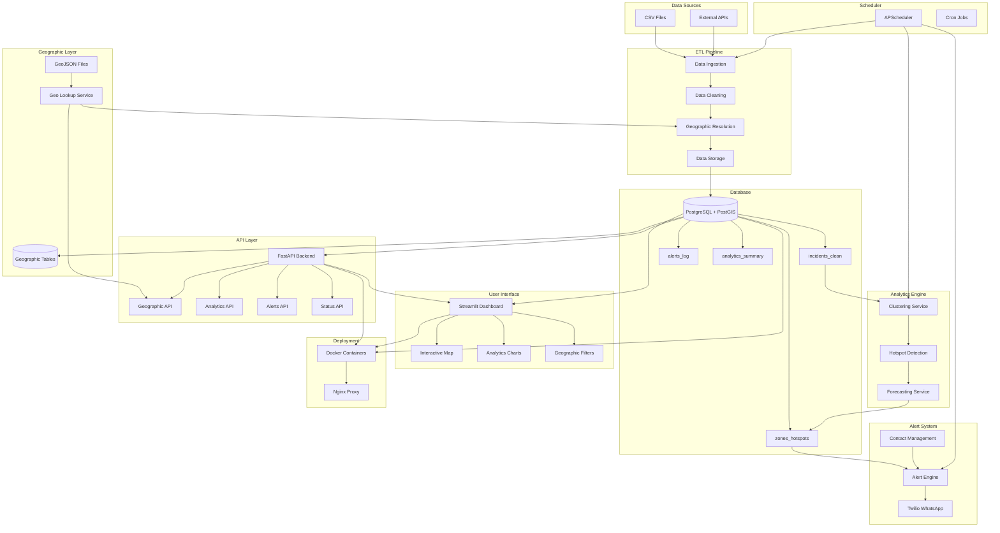
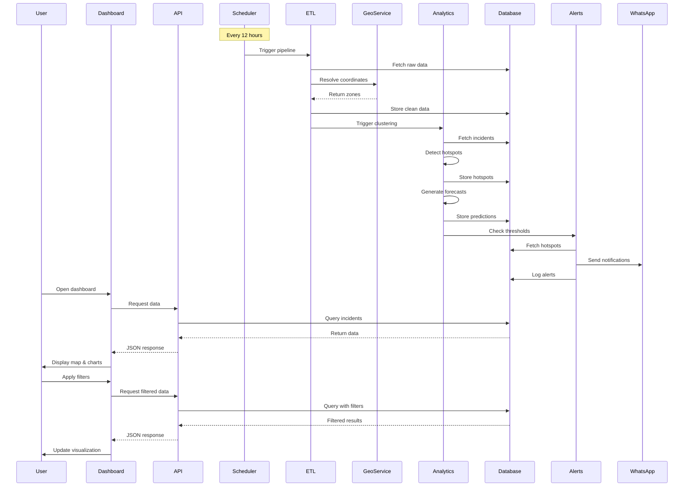
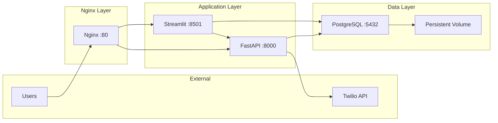

# Khareetaty-AI Architecture

## System Overview



## Data Flow



## Component Details

### 1. ETL Pipeline

**Purpose**: Ingest, clean, and enrich incident data

**Components**:
- `automation/etl_job.py` - Main ETL orchestrator
- `data_loader.py` - CSV/API ingestion
- `data_cleaner.py` - Data validation and cleaning

**Process**:
1. Read raw data from CSV or API
2. Validate schema and data types
3. Resolve coordinates to geographic zones
4. Store in `incidents_clean` table
5. Log resolution failures

**Frequency**: Every 12 hours (configurable)

### 2. Geographic Layer

**Purpose**: Resolve coordinates to administrative zones

**Components**:
- `backend/services/geo_lookup.py` - Point-in-polygon resolution
- `data/geo/kuwait/*.geojson` - Geographic boundaries
- Database tables: `geo_governorates`, `geo_districts`, `geo_blocks`, `geo_police_zones`

**Features**:
- Fast point-in-polygon queries using Shapely
- Prepared geometries for 10-100x performance
- Fallback to bounding box method
- Bilingual support (English/Arabic)

### 3. Analytics Engine

**Purpose**: Detect hotspots and predict future incidents

**Components**:
- `services/clustering.py` - DBSCAN clustering per zone
- `services/modeling.py` - Time-series forecasting
- `predictive_model.py` - ML model training

**Algorithms**:
- **Clustering**: DBSCAN with eps=0.01, min_samples=3
- **Forecasting**: Moving average (24h window)
- **Scoring**: Incident density + recency weight

**Output**: `zones_hotspots` table with scores and predictions

### 4. API Layer

**Purpose**: RESTful interface for data access and operations

**Endpoints**:

| Endpoint | Method | Description |
|----------|--------|-------------|
| `/status/live` | GET | System health check |
| `/geo/options` | GET | All geographic filters |
| `/geo/governorates` | GET | List governorates |
| `/geo/districts` | GET | List districts |
| `/geo/resolve` | POST | Resolve coordinates |
| `/geo/geojson/{layer}` | GET | Get GeoJSON data |
| `/analytics/run` | POST | Trigger pipeline |
| `/alerts/send` | POST | Send manual alert |
| `/alerts/trigger-hotspot` | POST | Trigger hotspot alerts |
| `/alerts/history` | GET | Alert history |
| `/alerts/stats` | GET | Alert statistics |

**Authentication**: Bearer token (JWT)

**Rate Limiting**: 100 requests/minute per IP

### 5. Alert System

**Purpose**: Intelligent notifications via WhatsApp

**Components**:
- `automation/trigger_alerts.py` - Alert logic
- `backend/api/alerts.py` - Alert API
- Twilio WhatsApp API integration

**Alert Types**:
1. **Hotspot Activation**: New high-score zone detected
2. **Forecast Warning**: Predicted surge in next 24h
3. **Trend Alert**: Significant week-over-week increase

**Format**:
```
🚨 Hotspot Detected
Zone: Salmiya District
Trend: +45% ↑
Forecast (24h): 23 incidents
Governorate: Hawalli
Timestamp: 2026-01-16 15:30
```

**Delivery**: Multi-contact support via `WHATSAPP_CONTACTS` env variable

### 6. Dashboard

**Purpose**: Interactive visualization and control interface

**Technology**: Streamlit

**Pages**:
1. **Map**: Interactive map with incident markers and hotspot overlays
2. **Hotspots**: List view with scores and statistics
3. **Trends**: Time-series analysis with charts
4. **Alerts**: Manual alert sending and history

**Features**:
- Real-time data updates
- Geographic filtering (governorate, district, police zone)
- Choropleth maps with intensity shading
- Forecast overlay markers
- KPI cards (total hotspots, dangerous zones, forecast load)
- Export to CSV/Excel

### 7. Scheduler

**Purpose**: Automated pipeline execution

**Technology**: APScheduler

**Jobs**:
- **Daily Pipeline**: 2:00 AM (ETL + Analytics + Alerts)
- **Hourly Health Check**: System status monitoring

**Configuration**:
```python
scheduler.add_job(
    run_daily_pipeline,
    'cron',
    hour=2,
    minute=0,
    id='daily_pipeline'
)
```

### 8. Database Schema

**Tables**:

#### incidents_clean
```sql
id, incident_type, lat, lon, timestamp,
district, block, police_zone, governorate
```

#### zones_hotspots
```sql
id, zone, zone_type, governorate, score,
forecast_count, forecast_timestamp, last_seen
```

#### geo_governorates
```sql
id, code, name_en, name_ar, geom
```

#### geo_districts
```sql
id, code, name_en, name_ar, governorate_code, geom
```

#### geo_blocks
```sql
id, code, name_en, name_ar, district_code, geom
```

#### geo_police_zones
```sql
id, code, name_en, name_ar, districts, geom
```

#### alerts_log
```sql
id, alert_type, message, recipient, status,
sent_at, error_message
```

#### analytics_summary
```sql
id, run_timestamp, etl_status, clustering_status,
forecasting_status, alerts_sent, duration_seconds
```

#### contacts
```sql
id, name, phone, role, zone, active
```

## Technology Stack

### Backend
- **Framework**: FastAPI 0.104+
- **Server**: Uvicorn (ASGI)
- **Language**: Python 3.11
- **Authentication**: JWT (PyJWT)

### Database
- **RDBMS**: PostgreSQL 16
- **Extension**: PostGIS 3.4
- **ORM**: psycopg2 (direct SQL)

### Analytics
- **Data Processing**: Pandas, NumPy
- **Clustering**: scikit-learn (DBSCAN)
- **Forecasting**: Prophet / Moving Average
- **Geospatial**: Shapely, GeoPy

### Frontend
- **Framework**: Streamlit 1.20+
- **Visualization**: Plotly, Matplotlib, Seaborn
- **Maps**: Plotly Scattermapbox

### Infrastructure
- **Containerization**: Docker, Docker Compose
- **Reverse Proxy**: Nginx
- **Scheduler**: APScheduler
- **Alerts**: Twilio WhatsApp API

## Deployment Architecture



## Security

### Authentication
- JWT tokens with expiration
- Role-based access control (admin, analyst, viewer)
- Bearer token for API access

### Data Protection
- PostgreSQL SSL connections
- Environment variable secrets
- No credentials in code

### Network Security
- Nginx reverse proxy
- Rate limiting (100 req/min)
- CORS configuration
- Firewall rules (Docker networks)

## Performance

### Optimization Strategies
1. **Database Indexing**: Timestamp, district, score columns
2. **Prepared Geometries**: 10-100x faster point-in-polygon
3. **Caching**: Streamlit cache (5min TTL)
4. **Connection Pooling**: pgbouncer for database
5. **Async Operations**: FastAPI async endpoints

### Scalability
- **Horizontal**: Multiple backend workers
- **Vertical**: Increase container resources
- **Database**: Read replicas for analytics
- **Caching**: Redis for API responses

## Monitoring

### Metrics
- API response times
- Database query performance
- ETL pipeline duration
- Alert delivery success rate
- Geographic resolution accuracy

### Logging
- Application logs: `/app/logs/`
- Database logs: PostgreSQL logs
- Nginx access logs
- Scheduler execution logs

### Health Checks
- `/status/live` endpoint
- Database connection test
- Geo service availability
- Twilio API connectivity

## Disaster Recovery

### Backup Strategy
- **Database**: Daily pg_dump
- **Data Files**: Daily tar.gz
- **Retention**: 30 days
- **Storage**: S3 or local NAS

### Recovery Procedures
1. Restore database from backup
2. Restore data files
3. Restart containers
4. Verify system status
5. Resume scheduler

## Future Enhancements

1. **Real-time Processing**: Apache Kafka for streaming
2. **Advanced ML**: Deep learning models (LSTM, Transformer)
3. **Mobile App**: React Native dashboard
4. **Multi-tenancy**: Support multiple cities/countries
5. **Predictive Routing**: Suggest patrol routes
6. **Integration**: Connect to official government systems
7. **Anomaly Detection**: Identify unusual patterns
8. **Natural Language**: ChatGPT integration for insights
